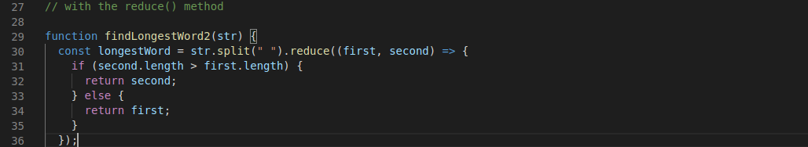

# 3rd solution on the "longest word" exercise

Step 1. Use split(" ") to split every sentence of the string

Step 2. sort it depending their length with the reduce() method

Step 3. Print out the one with the largest length
