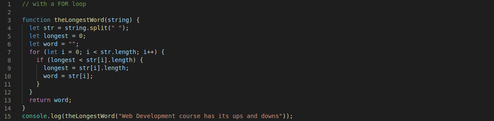

# 1st solution on the "longest word" exercise

Step 1. Create a variable result to store num

Step 2. Initiate the if statement to return 1 when the number input is  0 or 1

Step 3. Create the WHILE loop 

Step 4. Return the factorial of the provided integer
